# Dachser – Calculate Profit (Backend)

Spring Boot REST API implementing the **Calculate Profit** use case: given the
income and cost data submitted for a shipment, it computes and stores the
profit or loss (`profit = income - cost`).

This implements Task 1 of the assessment (`Example_Tasks_Software_Engineer_v1.pptx`)
and is consumed by the Angular frontend in `../frontend`.

## Tech stack

- Java 17
- Spring Boot 3.1.5 (Web, Data JPA, Validation)
- H2 (in-memory relational database)
- springdoc-openapi (Swagger UI)
- Lombok
- Maven (via the included wrapper, `mvnw` / `mvnw.cmd`)

## Architecture

Organized by layer under `org.dachser.shipment`, following the structure
requested in the assessment:

| Layer        | Package                          | Classes                                                              |
|--------------|-----------------------------------|-----------------------------------------------------------------------|
| Entities     | `entities`                        | `Shipment`, `Income`, `Cost`, `CostType`, `ProfitCalculation`         |
| Repositories | `repository`                      | `ShipmentRepository`, `IncomeRepository`, `CostRepository`, `CostTypeRepository`, `ProfitCalculationRepository` |
| DTOs         | `dto`                             | `ShipmentDto` (request), `CostDto`, `ProfitLossDto` (response)        |
| Mapper       | `mapper`                          | `ProfitCalculationMapper`                                             |
| Service      | `service`                         | `ProfitLossCalculationService`, `ShipmentService`                     |
| Controller   | `web`                             | `ProfitCalculationController` (the single exposed controller)        |
| Errors       | `exception`                       | `GlobalExceptionHandler`, `ErrorResponse`, and domain-specific exceptions (`ShipmentNotFoundException`, `ShipmentReferenceNotFoundException`, `CostTypeNotFoundException`, `InvalidDataException`) |

## Database schema

Defined in `src/main/resources/schema.sql`, loaded automatically into the H2
in-memory database on startup (`spring.sql.init.mode=always`):

- `shipment` — one row per shipment (business `reference`, e.g. `"0001"`).
- `cost_type` — lookup table for cost categories (`BASE`, `ADDITIONAL`).
- `income` — income entries linked to a shipment.
- `cost` — cost entries linked to a shipment and a `cost_type`.
- `profit_calculation` — stored result of each calculation (income, cost, profit, timestamp).

Foreign keys and indexes on all `shipment_id`/`cost_type_id` columns are included.

Seed data (3 sample shipments, `0001`–`0003`, with sample income/cost/calculation
rows) is loaded from `src/main/resources/data.sql`.

### Table relationships


- open it with browser
- `shipment` is the central table: `income`, `cost` and `profit_calculation` each
  reference it via `shipment_id` (1 shipment → N rows in each).
- `cost` also references `cost_type` via `cost_type_id` (1 cost type → N costs).

## Getting started

```bash
./mvnw spring-boot:run
```

(or `mvnw.cmd spring-boot:run` on Windows). The API starts on
`http://localhost:8080` (Spring Boot default port — this is what the frontend's
`proxy.conf.json` points to).

The H2 web console is enabled for inspecting the in-memory database while the
app is running: `http://localhost:8080/h2-console` (JDBC URL:
`jdbc:h2:mem:shipmentdb`, user `sa`, empty password).

## API

Single controller, exposed under `/profitLoss`:

| Method | Path                              | Description                                          |
|--------|-------------------------------------|-------------------------------------------------------|
| GET    | `/profitLoss/references`            | List all shipment business references                |
| GET    | `/profitLoss?shipmentReference=...` | List all profit/loss calculations for a shipment      |
| POST   | `/profitLoss/calculation`           | Submit income/costs and calculate the profit or loss  |

`POST /profitLoss/calculation` returns `201 Created` with the calculated
`ProfitLossDto` in the body and **no `Location` header**: there is no
single-resource endpoint for one calculation (only the list endpoint above),
so a `Location` pointing back at that list wouldn't uniquely identify the
resource just created.

Full interactive documentation (request/response schemas, try-it-out) is
available once the app is running:

- Swagger UI: `http://localhost:8080/swagger-ui.html`
- Raw OpenAPI spec: `http://localhost:8080/v3/api-docs`

## Testing the API manually

A ready-to-import Postman collection is included at
`Shipment-ProfitLoss.postman_collection.json` (root of this project), covering:

- Calculate Profit/Loss (happy path — `201 Created`)
- Calculate Profit/Loss – Invalid (all zero) (`400 Bad Request`)
- Get Profit/Loss by Shipment Reference (`200 OK`)
- Get Profit/Loss by Shipment Reference – Not Found (`404 Not Found`)
- Get All Shipment References (`200 OK`)

## Running the automated tests

```bash
./mvnw test
```

Runs `ProfitCalculationControllerTest` and `ProfitLossCalculationServiceTest`
(JUnit, via `spring-boot-starter-test`). Reports are written to
`target/surefire-reports`.

### Test coverage

Configured via the JaCoCo Maven plugin (see `pom.xml`):

```xml
<plugin>
    <groupId>org.jacoco</groupId>
    <artifactId>jacoco-maven-plugin</artifactId>
    <version>0.8.11</version>
    <executions>
        <execution>
            <id>prepare-agent</id>
            <goals>
                <goal>prepare-agent</goal>
            </goals>
        </execution>
        <execution>
            <id>report</id>
            <phase>test</phase>
            <goals>
                <goal>report</goal>
            </goals>
        </execution>
    </executions>
</plugin>
```

Running `./mvnw test` instruments the code (`prepare-agent`) and generates the
report automatically at the end of the `test` phase — no extra command needed.
Open `target/site/jacoco/index.html` for the full report.

## Generating Javadoc

```bash
./mvnw javadoc:javadoc
```

Outputs to `target/site/apidocs` (an already-generated copy is checked in
under `javadoc/index.html` at the project root).
